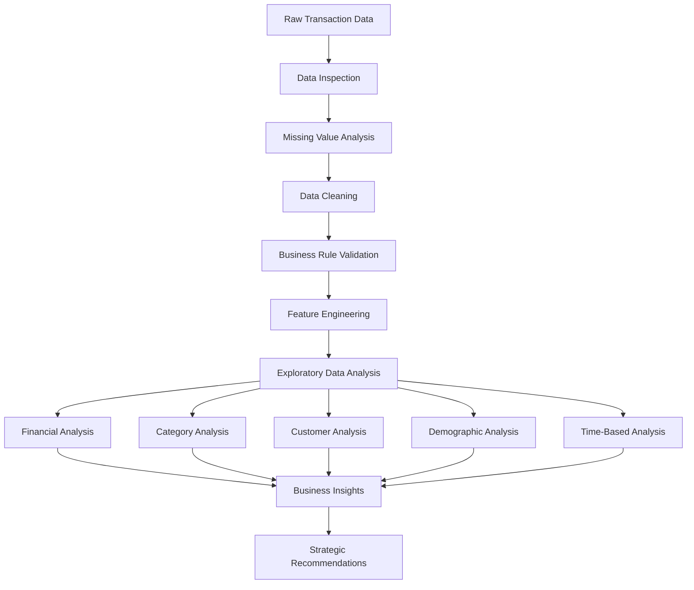

# 🛒 Retail Sales Analysis

> **End-to-end retail analytics project using Python to analyze sales performance, profitability, customer behavior, product categories, demographics, and time-based purchasing patterns.**

---

## 📊 Dashboard Preview

<!-- Replace the image path below with your dashboard screenshot -->

<p align="center">
  
</p>

### 🔎 Dashboard Highlights

* 💰 Revenue and gross profit overview
* 📈 Monthly sales trends
* 🏷️ Category performance
* 👥 Customer demographics
* 🎯 Customer segmentation
* 📅 Day and month performance
* 🛍️ Sales and transaction KPIs

> 📌 **Dashboard:** Add your final dashboard screenshot above.

---

## 🖼️ Project Visuals

Add your most important charts and screenshots here.

### 💰 Revenue & Category Performance

<p align="center">
  
</p>

**Revenue by Product Category**

> 📌 Add your category revenue chart here.

---

### 📈 Monthly Sales Performance

<p align="center">
  
</p>

**Monthly Revenue Trend**

> 📌 Add your monthly sales/revenue visualization here.

---

### 👥 Customer Analysis

<p align="center">
  
</p>

**Customer Segment Performance**

> 📌 Add your customer segmentation visualization here.

---

### 🎯 Age × Category Analysis

<p align="center">
  
</p>

**Revenue by Age Group and Product Category**

> 📌 Add your age × category visualization here.

---

### 📅 Time-Based Analysis

<p align="center">
  
</p>

**Revenue by Day of Week**

> 📌 Add your day-of-week visualization here.

---

# 📊 Executive Summary

| Metric                 |       Result |
| ---------------------- | -----------: |
| 💰 Total Revenue       | **$908,230** |
| 📈 Gross Profit        | **$719,302** |
| 📊 Gross Margin        |    **79.2%** |
| 🧾 Transactions        |    **1,987** |
| 🛍️ Units Sold         |    **4,995** |
| 🧮 Average Order Value |  **$457.09** |
| 📦 Units / Transaction |     **2.51** |
| 👥 Customers           |      **155** |
| 🧹 Data Retention      |   **99.35%** |

---

# 🎯 Business Problem

Retail businesses need to understand more than total sales. They need to identify:

* Which categories generate the most revenue?
* Which categories are most profitable?
* Who are the highest-value customers?
* How does purchasing behavior vary by age and gender?
* Which age × category combinations are most valuable?
* Which days and months generate the strongest sales?
* How frequently do customers purchase?
* Where should marketing and promotional investment be concentrated?
* How can inventory, promotions, and loyalty strategies be optimized?

This project answers these questions using transaction-level retail data.

---

# 🧰 Tools & Technologies

| Tool                | Purpose                          |
| ------------------- | -------------------------------- |
| 🐍 Python           | Data analysis and business logic |
| 🐼 Pandas           | Data cleaning and transformation |
| 🔢 NumPy            | Numerical calculations           |
| 📊 Matplotlib       | Data visualization               |
| 📈 Seaborn          | Statistical visualization        |
| 📓 Jupyter Notebook | Interactive analysis             |
| 🌐 HTML             | Exported analytical reports      |

---

# 🔄 Analysis Workflow



---

# 🧹 Data Cleaning & Validation

The raw dataset contained:

* **2,000 transaction records**
* **11 columns**

### Identified Issues

* Missing customer age values
* Missing quantity values
* Missing price values
* Missing COGS values
* Missing sales values
* Column naming issue: `quantiy` → `quantity`
* Date/time fields requiring conversion
* Business-rule inconsistencies requiring validation

### Cleaning Rules

| Rule           | Requirement                 |
| -------------- | --------------------------- |
| Quantity       | Positive                    |
| Selling Price  | Positive                    |
| Total Sale     | `quantity × price_per_unit` |
| COGS           | Non-negative                |
| Transaction ID | Valid                       |
| Date           | Correct datetime type       |
| Time           | Correct time representation |

### Data Retention

| Measure         |      Value |
| --------------- | ---------: |
| Raw Records     |      2,000 |
| Clean Records   |  **1,987** |
| Records Removed |         13 |
| Retention Rate  | **99.35%** |
| Removal Rate    |      0.65% |

---

# 💰 Financial Performance

| Metric              |       Result |
| ------------------- | -----------: |
| Total Revenue       | **$908,230** |
| Total Units Sold    |    **4,995** |
| Transactions        |    **1,987** |
| Average Order Value |  **$457.09** |
| Gross Profit        | **$719,302** |
| Gross Margin        |    **79.2%** |
| Units / Transaction |     **2.51** |

### Key Insight

The analysis indicates a strong reported profitability profile, with approximately **$908K revenue** and a reported **79.2% gross margin** across the analyzed period.

---

# 🏷️ Product Category Performance

| Category       |      Revenue | Revenue Share |         AOV | Units / Order | Gross Margin |
| -------------- | -----------: | ------------: | ----------: | ------------: | -----------: |
| 🔌 Electronics | **$311,445** |     **34.3%** |     $459.36 |          2.48 |        78.6% |
| 👕 Clothing    | **$309,995** |     **34.1%** |     $444.12 |      **2.55** |        79.3% |
| 💄 Beauty      | **$286,790** |     **31.6%** | **$469.38** |          2.51 |    **79.7%** |

### Key Findings

* 🔌 **Electronics** → highest revenue
* 👕 **Clothing** → highest units per transaction
* 💄 **Beauty** → highest AOV and reported gross margin

---

# 👥 Customer Analysis

## 🎂 Age Group Performance

| Age Group |      Revenue | Customer Share | Revenue / Customer |         AOV | Top Category |
| --------- | -----------: | -------------: | -----------------: | ----------: | ------------ |
| 18–24     |     $149,160 |          18.1% |             $5,327 | **$503.92** | Beauty       |
| 25–34     | **$194,090** |          20.6% |             $6,065 |     $479.23 | Clothing     |
| 35–44     |     $193,595 |          17.4% |             $7,170 |     $468.75 | Electronics  |
| 45–54     |     $193,395 |      **29.7%** |             $4,204 |     $432.65 | Beauty       |
| 55–64     |     $177,990 |          14.2% |         **$8,090** |     $417.82 | Electronics  |

### Key Findings

* **25–34** has the highest reported revenue.
* **18–24** has the highest reported AOV.
* **45–54** has the largest customer share.
* **55–64** has the highest revenue per customer.
* Category preferences vary significantly by age.

---

# 👩‍💼 Gender Analysis

| Gender | Customer Share | Revenue Share |     AOV | Top Category | Gross Margin |
| ------ | -------------: | ------------: | ------: | ------------ | -----------: |
| Female |            51% |     **51.0%** | $457.62 | Clothing     |        77.8% |
| Male   |            49% |         49.0% | $456.53 | Electronics  |    **80.7%** |

---

# 🎯 Age × Category Segmentation

| Rank | Segment × Category  |     Revenue |     AOV | Gross Margin |
| ---: | ------------------- | ----------: | ------: | -----------: |
| 🥇 1 | 25–34 × Clothing    | **$83,190** | $573.72 |        78.7% |
| 🥈 2 | 55–64 × Electronics | **$74,130** | $518.39 |        78.0% |
| 🥉 3 | 35–44 × Electronics | **$72,920** | $473.51 |    **82.1%** |
|    4 | 45–54 × Beauty      | **$71,900** | $492.47 |        80.4% |
|    5 | 25–34 × Beauty      |     $57,080 | $419.71 |        79.3% |

---

# 📅 Time-Based Performance

## 🗓️ Day of Week

| Day       |      Revenue |
| --------- | -----------: |
| 🥇 Sunday | **$152,800** |
| Monday    |     $147,575 |
| Saturday  |     $141,400 |
| Tuesday   | **$102,845** |

**Sunday** is the strongest reported shopping day, while **Tuesday** is the weakest.

---

## 📆 Monthly Performance

| Month       |     Revenue |
| ----------- | ----------: |
| 🥇 December | **$71,880** |
| November    |     $68,915 |
| October     |     $67,735 |
| February    | **$16,110** |

December is the strongest reported month, highlighting the importance of Q4 planning.

---

# 🔁 Customer Loyalty & Purchase Frequency

| Metric                          |          Result |
| ------------------------------- | --------------: |
| Total Customers                 |         **155** |
| Reported Repeat Customer Rate   |        **100%** |
| Average Transactions / Customer |       **12.82** |
| Average Revenue / Customer      |   **$5,859.55** |
| Most Frequent Customer          | **Customer #3** |
| Transactions by Customer #3     |          **76** |
| Highest Spending Customer       | **Customer #3** |
| Highest Spending                |     **$38,440** |

> ⚠️ The reported 100% repeat-customer rate depends on the dataset's customer and transaction definitions.

---

# 💡 Key Business Insights

### 🔌 1. Electronics is the Revenue Engine

Electronics generated the highest category revenue at **$311,445**.

### 💄 2. Beauty Has Strong Economic Value

Beauty recorded the highest reported AOV and gross margin.

### 👕 3. Clothing Drives Basket Size

Clothing achieved the highest units-per-transaction figure.

### 🎯 4. Customer Preferences Vary by Age

Each age group demonstrates different category preferences.

### 📅 5. Sunday is the Strongest Shopping Day

Sunday revenue significantly exceeds Tuesday revenue.

### 🎄 6. Q4 is Strategically Important

October–December shows strong performance, with December leading.

### ❤️ 7. High-Frequency Customers Represent a Loyalty Opportunity

Highly frequent customers can be targeted with VIP and retention strategies.

---

# 🎯 Strategic Recommendations

### 1. Target High-Value Segments

* Prioritize **25–34 × Clothing** campaigns.
* Target the **18–24** segment with personalized offers.
* Use age × category preferences for recommendations.

### 2. Leverage Category Strengths

* Maintain Electronics inventory during peak periods.
* Use Beauty for margin-focused cross-selling.
* Use Clothing for basket-building strategies.

### 3. Optimize Promotions

* Focus major promotions around Sunday/weekends.
* Test Tuesday-specific campaigns.
* Prepare inventory before Q4 demand peaks.

### 4. Improve Personalization

Use customer:

* Age
* Gender
* Purchase history
* Category preference
* Purchase frequency
* Customer value

to develop personalized marketing.

### 5. Build Loyalty Programs

Reward high-frequency customers with:

* VIP benefits
* Loyalty points
* Personalized offers
* Early access
* Exclusive promotions

---

# 📂 Project Structure

```text
retail-sales-analysis/
│
├── README.md
│
├── data/
│   ├── raw/
│   │   └── SQL - Retail Sales Analysis_utf .csv
│   │
│   └── processed/
│       └── retail_sales_clean.csv
│
├── notebooks/
│   ├── Retail-sales-analysis-01.ipynb
│   └── 02_FINANCIAL_RETAIL_ANALYSIS_FULL_JN.ipynb
│
├── reports/
│   ├── Retail-sales-analysis.html
│   └── 02_FINANCIAL_RETAIL_ANALYSIS_FULL.html
│
└── assets/
    └── dashboard/
        ├── retail_sales_dashboard.png
        ├── revenue_by_category.png
        ├── monthly_revenue.png
        ├── customer_segments.png
        ├── age_category_analysis.png
        └── day_of_week_sales.png
```

---

# 📓 Notebooks

### Retail Sales Analysis

`notebooks/Retail-sales-analysis-01.ipynb`

Includes:

* Data inspection
* Data audit
* Missing-value analysis
* Data cleaning
* Validation
* Feature engineering
* EDA
* Customer analysis
* Category analysis
* Time-based analysis

### Financial Retail Analysis

`notebooks/02_FINANCIAL_RETAIL_ANALYSIS_FULL_JN.ipynb`

Includes:

* Revenue analysis
* COGS
* Gross profit
* Gross margin
* AOV
* Category profitability
* Customer economics
* Executive insights

---

# 📄 Reports

HTML versions of the analysis are available in the `reports/` directory.

* `Retail-sales-analysis.html`
* `02_FINANCIAL_RETAIL_ANALYSIS_FULL.html`

---

# ▶️ How to Run

### 1. Clone the Repository

```bash
git clone <your-repository-url>
cd <your-repository-folder>
```

### 2. Create a Virtual Environment

**Windows**

```bash
python -m venv .venv
.venv\Scripts\activate
```

**macOS / Linux**

```bash
python -m venv .venv
source .venv/bin/activate
```

### 3. Install Dependencies

```bash
pip install pandas numpy matplotlib seaborn jupyter
```

### 4. Start Jupyter

```bash
jupyter notebook
```

### 5. Run the Analysis

Open the notebook and execute the cells from top to bottom.

---

# 📈 Deliverables

* ✅ Cleaned retail transaction dataset
* ✅ Data-quality audit
* ✅ Data-validation checks
* ✅ Exploratory data analysis
* ✅ Financial performance analysis
* ✅ Category analysis
* ✅ Customer segmentation
* ✅ Demographic analysis
* ✅ Age × category analysis
* ✅ Monthly revenue analysis
* ✅ Day-of-week analysis
* ✅ Customer purchase-frequency analysis
* ✅ Business recommendations
* ✅ Executive summary
* ✅ HTML analytical reports

---

# 📌 Conclusion

This project demonstrates how raw retail transaction data can be transformed into actionable business intelligence through a structured analytics workflow.

The analysis highlights:

* 💰 **$908K+ reported revenue**
* 📈 **79.2% reported gross margin**
* 🔌 Strong Electronics revenue performance
* 💄 Strong Beauty profitability
* 👕 High Clothing basket size
* 🎯 Distinct customer preferences
* 📅 Significant seasonality
* ❤️ High reported repeat-purchase activity
* 🚀 Opportunities for targeted marketing, cross-selling, loyalty, and demand planning

The goal is to move beyond descriptive reporting and use data to support better **commercial, customer, marketing, and operational decisions**.

---

# 👤 Author

## **SARTHAK SHARMA**

**Retail Sales Analysis Project**

---

# 📄 License

Add the license appropriate for your repository.

For an open-source project, an **MIT License** is one possible option.
